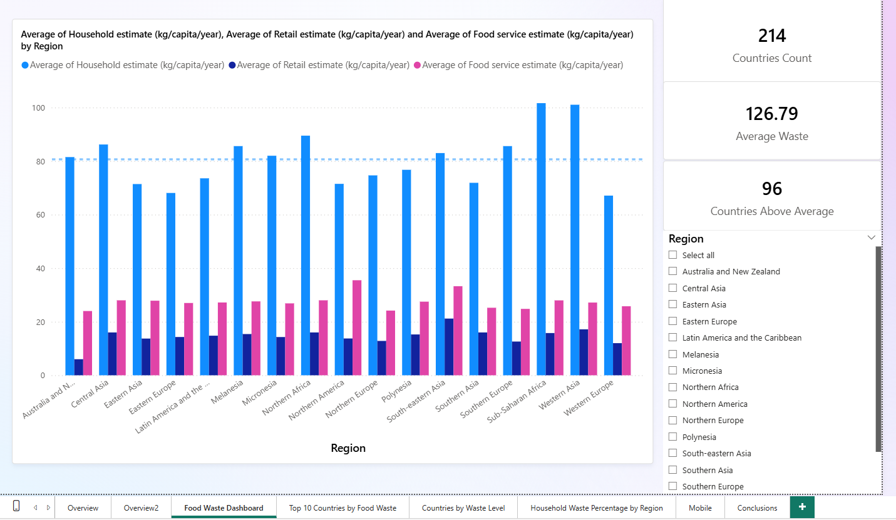
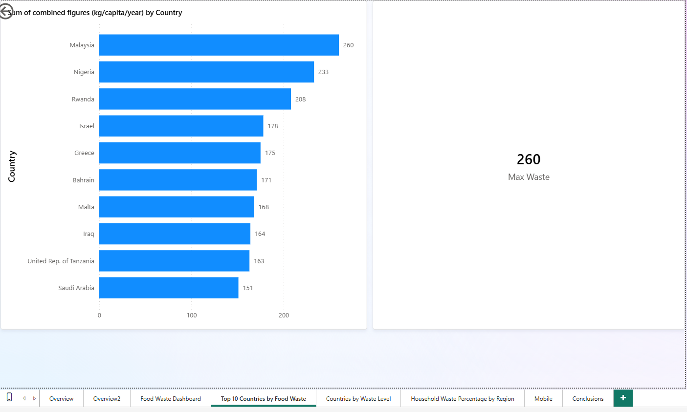
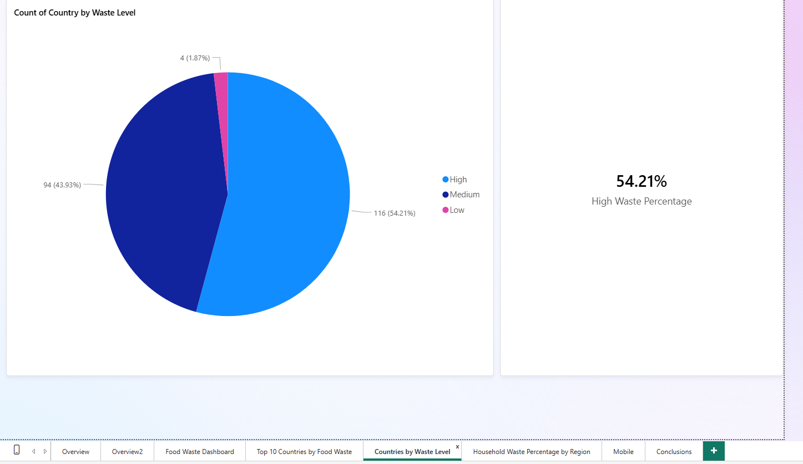
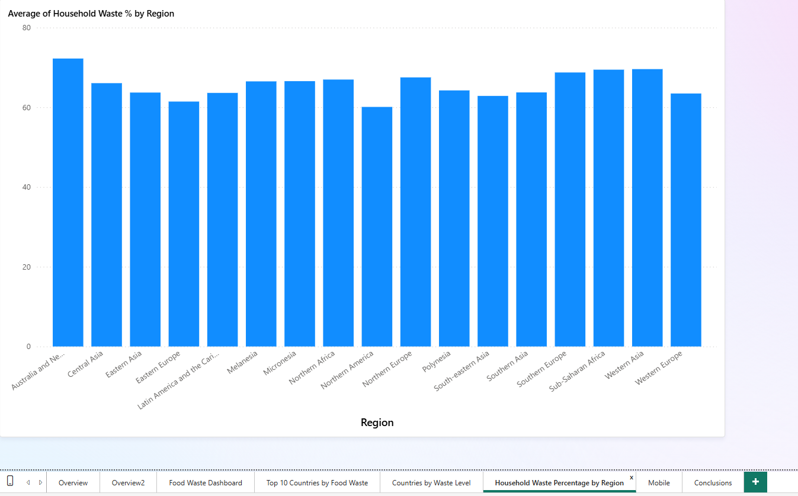
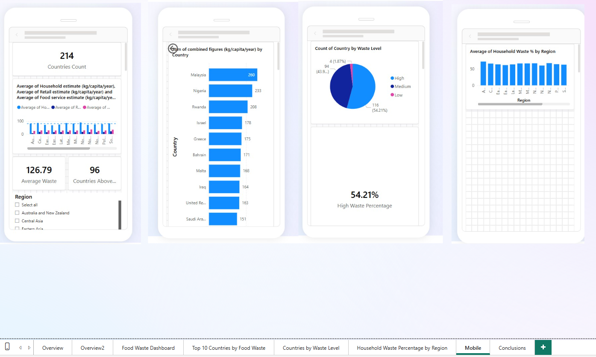

# 🍽️ Food Waste Analytics Dashboard

## 📊 Project Overview

This Power BI project analyzes global food waste data across 214 countries and multiple world regions.

The goal of the project is to identify food waste patterns, compare countries and regions, and provide insights that may support future waste reduction initiatives.

---

## 🎯 Research Questions

- Which countries generate the highest levels of food waste?
- How does food waste vary across different regions?
- What percentage of countries fall into each waste level category?
- Which regions have the highest household food waste contribution?
- What trends can be identified from global food waste data?

---

## 🛠️ Tools & Technologies

- Power BI
- Power Query
- DAX
- Data Cleaning
- Data Transformation
- Data Visualization
- Business Intelligence

---

## 📈 Dataset Information

The dataset contains food waste estimates from:

- Households
- Retail Sector
- Food Service Sector

for 214 countries worldwide.

Key metrics include:

- Household Waste (kg/capita/year)
- Retail Waste (kg/capita/year)
- Food Service Waste (kg/capita/year)
- Total Food Waste
- Regional Classification

---

## 📸 Dashboard Preview

### Main Dashboard

Provides an overview of food waste estimates by region, including KPI cards, regional filtering, and comparisons between household, retail, and food service waste.

### Top 10 Countries by Food Waste

Highlights the countries with the highest food waste generation.

### Countries by Waste Level

Classifies countries into High, Medium, and Low food waste categories.

### Household Waste Percentage by Region

Compares household waste contribution across world regions.

### Mobile Dashboard Version

A dedicated mobile-friendly version of the dashboard was designed to improve accessibility and user experience on smaller screens.

---

## 🔍 Key Insights

- Significant regional differences exist in food waste generation.
- Household waste represents the largest contributor to food waste in most regions.
- Over half of the analyzed countries belong to the High Waste category.
- Malaysia recorded the highest food waste value in the dataset.
- Interactive filtering allows users to explore regional and country-level trends.

---

## 🚀 Skills Demonstrated

- Data Analysis
- Data Cleaning
- KPI Design
- Dashboard Development
- DAX Calculations
- Business Intelligence Reporting
- Data Storytelling
- Mobile Report Design

---

## 👩‍💻 Author

**Shir Feldman**

QA Automation Engineer | Management Information Systems Graduate
